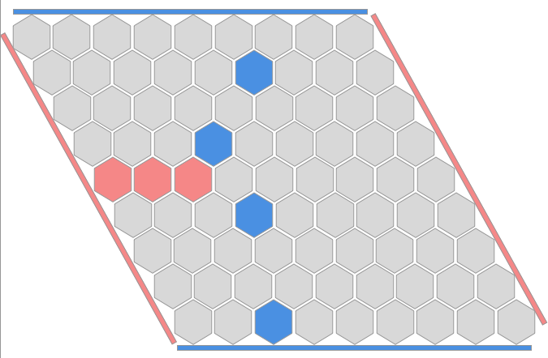
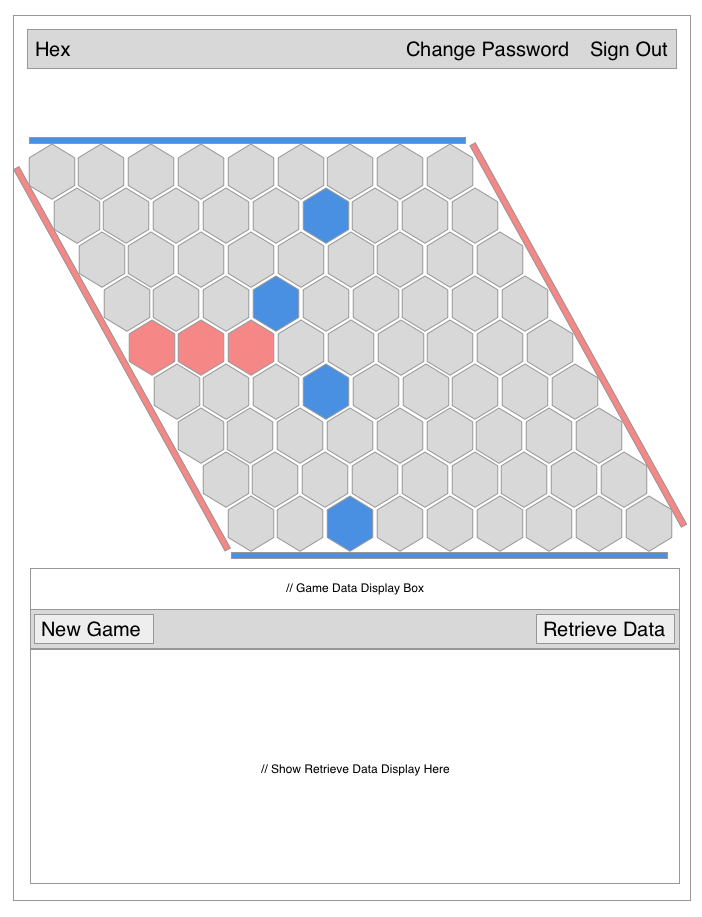
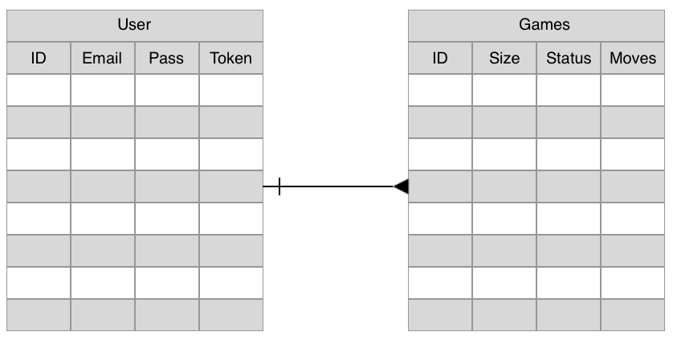

# Project 2: Hex Game
## What is Hex?
  Hex is a graph based game in which two players, each controlling two parallel sides of a square board, attempt to place pieces in a way that connects their sides before the opponent is able to connect theirs. It has been used in many instances of graph theory evaluation as well as research into computer algoritms.

  
## Project Planning
### User Stories
#### User Authentication
  - As a user, I want to be able to:
    - Create User
    - Login
    - Change Password
    - Log Out

#### Gameplay
  - After logging in, I want to be able to play a game:
    - Select a game board size
    - Create a new game
    - Play a game of Hex
    - Store my games in a remote server
    - Recieve feedback on who won the game and how
    - Delete games that are no longer relevant

#### Analysis
  - After logging in, I want to be able to view past games:
    - View all games played
      - Sort in some usable order?
    - View statistics of win/loss ratios

#### Advanced Functionality `Not V1 or MVP`
  - As a user, I want to be able to:
    - Change the game board size
    - Play against a computer opponent
    - Sort the games I've played in some sort of usable order
      - Sort by complexity
      - Sort by wins or losses
      - Sort by opponent: computer or human?

## Proposed Schedule
#### Working Toward MVP
  - Phase 1: User Interface
    - Use HTML and CSS to create a basic webpage
    - Add event listeners that detect game selections and general user inputs
  - Phase 2: Local Game Logic
    - Implement game logic allowing for making moves and determining win
  - Phase 3: User Authentication (Day 2)
    - Implement all user authentication functionality listed in user stories
  - Phase 4: API Interface
    - Update game status to the server
    - Retrieve past games from the server
    - Use Handlebars to generate pretty output of server

#### Moving Past MVP
  - P5: Advanced Functionality
    - High functionality AI opponent implemented using Dikstra's algorithm combined with a minimax or Monte Carlo tree
    - Select a game board size of 7, 9, or 11 hexagons square

## Planning Sketches
### Wireframes
  
### ERB
  
