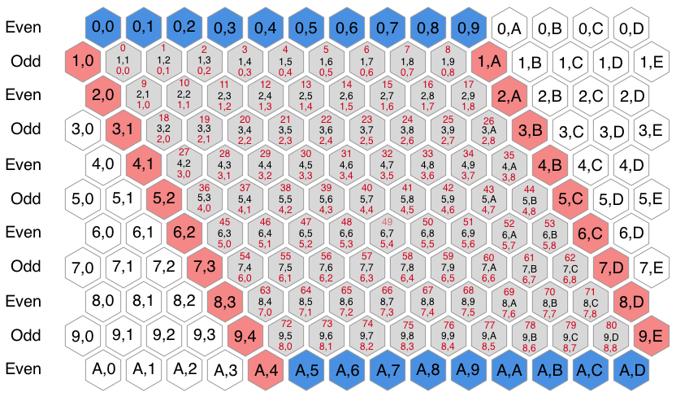

# Project 2: Hex Game
`NOTE: This readme is replicated in its entirety for both the client and api readmes`
## What is Hex?
  Hex is a graph based game in which two players, each controlling two parallel sides of a parallelogram board, attempt to place pieces in a way that connects their sides of the board before the opponent is able to connect theirs. It has been used in many instances of graph theory and game theory, with a particular focus on computer algorithms.

  

## Documentation
  ### Locations:
  | Item | Link |
  |:------:|:------:|
  | Client Host  | https://ckempema.github.io/project-2-client/ |
  | Backend Host  | https://still-meadow-60017.herokuapp.com  |
  | Client Repo  | https://github.com/ckempema/project-2-client |
  | Backend Repo | https://github.com/ckempema/hex-api |

  The game is entirely run in the client browser, however the backend will store users and all the games they have created, allowing for a user to review previous games.

  ### Technologies Used
  #### Front End
  - Javascript
  - Bootstrap
  - Handlebars
  - JQuery
  - HTML
  - CSS/SASS
  #### Back End
  - Ruby
  - Rails
  - Heroku App

  ### Unsolved Problems
  A majority of the problems existing in the current version relate to user experience or future functionality. The user experience could be improved, particularly in terms of explaining what is going on on the front page. I also planned to implement an AI for the user to play against, but time constraints prevented me from making a serious attempt before the project MVP was due.

  ### Hurdles
  When I first started out, I had a good plan that stayed with me throughout the project, as documented below. However I encountered major issues trying to draw a board that looked halfway decent, and then structuring my data in a way that it was useable. The id structure of the board can be seen below.

##### Hexagon Layout and Numbering Systems
  

  Hexagons involved in the game itself (not part of the border or hidden) are referenced as a row and column, or as an id derived from the row and column. The gameboard is structured such that the top left corner has a position of 0,0 which requires offsetting from the actual rectangle positions for each game piece. The math to do this offset dynamically for any size board, as well as draw out the appropriate boarders, took significantly more time than planned, which left me struggling for time later on.

## Project Planning
### User Stories
#### User Authentication
  - As a user, I want to be able to:
    - Create User
    - Login
    - Change Password
    - Log Out

#### Gameplay
  - After logging in, I want to be able to play a game:
    - Select a game board size
    - Create a new game
    - Play a game of Hex
    - Store my games in a remote server
    - Recieve feedback on who won the game and how
    - Delete games that are no longer relevant

#### Analysis
  - After logging in, I want to be able to view past games:
    - View all games played
      - Sort in some usable order?
    - View statistics of win/loss ratios

#### Advanced Functionality `Not V1 or MVP`
  - As a user, I want to be able to:
    - Change the game board size
    - Play against a computer opponent
    - Sort the games I've played in some sort of usable order
      - Sort by complexity
      - Sort by wins or losses
      - Sort by opponent: computer or human?

## Proposed Schedule
#### Working Toward MVP
  - Phase 1: User Interface
    - Use HTML and CSS to create a basic webpage
    - Add event listeners that detect game selections and general user inputs
  - Phase 2: Local Game Logic
    - Implement game logic allowing for making moves and determining win
  - Phase 3: User Authentication (Day 2)
    - Implement all user authentication functionality listed in user stories
  - Phase 4: API Interface
    - Update game status to the server
    - Retrieve past games from the server
    - Use Handlebars to generate pretty output of server

#### Moving Past MVP
  - P5: Advanced Functionality
    - High functionality AI opponent implemented using Dikstra's algorithm combined with a minimax or Monte Carlo tree
    - Select a game board size of 7, 9, or 11 hexagons square

## Planning Sketches
### Wireframes
  ##### Post Login Webpage View
  
### ERD
  
